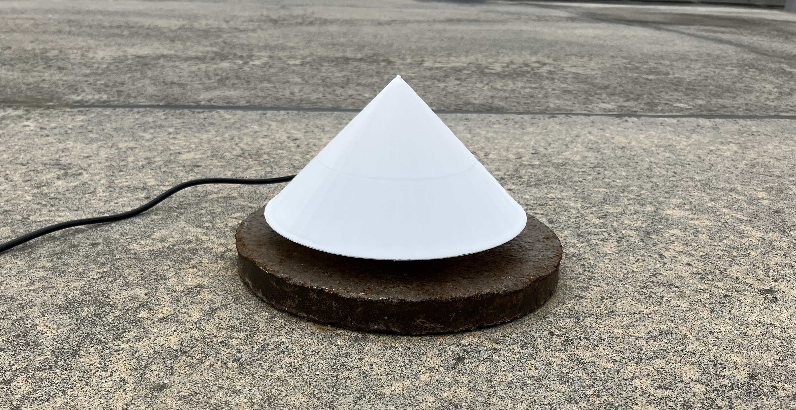

# MEMS Rain Gauge  

## Prerequisite
 - ADXL355 ([EVAL-ADXL355-PMDZ](https://www.analog.com/en/products/adxl355.html#product-overview))
 - [M5Stack Tough](https://docs.m5stack.com/en/core/tough) 
 - [modified version](https://github.com/T40O0/M5_ADXL355/tree/M5) of [plasmapper/adxl355-arduino](https://github.com/plasmapper/adxl355-arduino)  
Hats off to PL.

## Features
 - Cheap; can be made for about 100€.
 - Record the number of times the set acceleration of 4 steps is exceeded and the total acceleration.
 - Multiply the number of times by a coefficient and convert to rainfall (mm).
 - Stores files on TF card.
 - No need to worry about clogging caused by volcanic ash etc. that occurs with tipping bucket rain gauges.

## Installation & How to start
 - Visit me on [MEMS Seismometer](https://github.com/T40O0/ADXL355_SPI_M5_SD_FIR)

## Note
 - In my area, rainfall estimates using the following coefficients gave R2 = 0.97 with hourly rainfall (mm/h) from a tipping bucket gauge 20 metres away.
   - 5gal exceedance frequency x 0.0002281 (mm)
   - 10gal exceedance frequency x 0.0004399 (mm)
 - Data are recorded every minute. These can be aggregated to estimate the rainfall every 10 minutes or hour.
 - A 1000 Hz high-cut filter is applied to the data output at 4000 Hz from the ADXL355. This is re-sampled at 100 Hz without a decimation filter, so frequency analysis is not possible. If you are interested in frequencies, click here [MEMS Seismometer](https://github.com/T40O0/ADXL355_SPI_M5_SD_FIR).
 - A "[hat](3D_model/hat.stl)" is required.
   - [x] Blocks sunlight and protects the LCD.
   - [x] Falling volcanic ash is washed away by rain.
 - Do not submerge the case in water or other liquids.
 - For more information, see [MEMS Seismometer](https://github.com/T40O0/ADXL355_SPI_M5_SD_FIR).

## Licence
This project is licensed under the MIT licence - see the [LICENSE file](LICENSE) for details.
