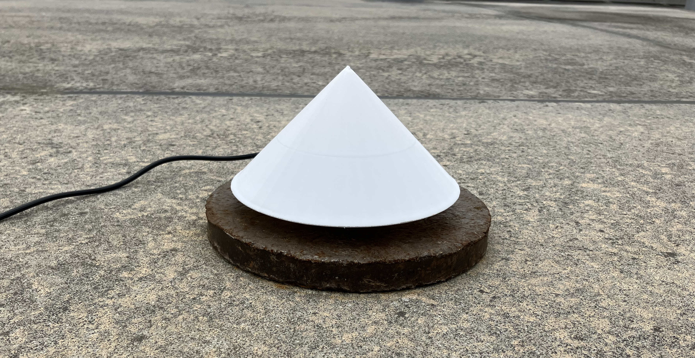
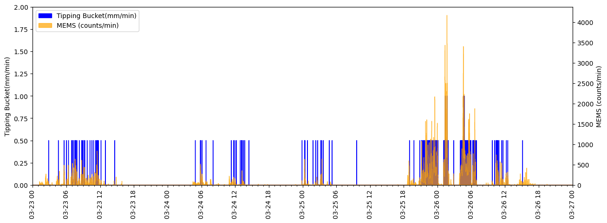

# MEMS Rain Gauge  

## Prerequisite
 - ADXL355 ([EVAL-ADXL355-PMDZ](https://www.analog.com/en/products/adxl355.html#product-overview))
 - [M5Stack Tough](https://docs.m5stack.com/en/core/tough)
 - [hat](https://github.com/T40O0/ADXL355_SPI_M5_SD_FIR/blob/main/3D_model/hat.stl)
 - [modified version](https://github.com/T40O0/M5_ADXL355/tree/M5) of [plasmapper/adxl355-arduino](https://github.com/plasmapper/adxl355-arduino)  
Hats off to PL.

## Features
 - Cost-effective: It can be built for around €100.
 - Tracking: records the running sum of acceleration and the count of samples that exceed four preset thresholds (5 / 10 / 20 / 30 gal), one row per minute.
 - Rainfall conversion: multiplies the per-minute exceedance frequency by an empirical coefficient to estimate rainfall in mm.
 - Local storage: saves a single CSV per day on a TF (microSD) card (`/YYYYMMDD.csv`).
 - Built-in Wi-Fi AP + FTP server for data retrieval (no SD card removal required).
 - Maintenance-free: prevents clogging issues caused by volcanic ash, which commonly affect traditional tipping bucket rain gauges.

## Installation
 - Wire and mount the ADXL355 the same as the [MEMS Seismometer](https://github.com/T40O0/ADXL355_SPI_M5_SD_FIR).
 - Upload this sketch to the M5Stack Tough using the Arduino IDE.

## How to start
On power-on, a startup screen with four options is shown for 30 seconds. Tap a button, or wait for the timer to elapse.

1. **Wi-Fi Setting** - SmartConfig (set or change the Wi-Fi access point), then NTP sync of the RTC.
2. **Reset RTC** - Connect to a saved Wi-Fi access point and resync the RTC via NTP.
3. **Manual Set** - Set RTC year/month/day/hour/minute/second on the touch screen (no Wi-Fi needed).
4. **Data Dump** - Start a SoftAP + FTP server. Connect a PC to the AP and pull files via Explorer.

After any of the above (or after the 30 second timeout), measurement begins at the next RTC second `00`.

## Note
 - In my testing area, rainfall estimates using the following coefficients gave R2 = 0.97 against hourly rainfall (mm/h) from a tipping bucket rain gauge located 20 meters away.
   - 5 gal exceedance frequency × 0.0002281 (mm)
   - 10 gal exceedance frequency × 0.0004399 (mm)
 - Data are recorded one row per minute. Rows can be aggregated to estimate rainfall every 10 minutes, hourly, etc.
 - **Sampling**: ADXL355 ODR=4000 Hz → polled at 100 Hz in software → aggregated to 1 CSV row per minute. The wide ODR keeps the built-in 1000 Hz LPF from cutting raindrop impulses.
 - Aliasing is allowed by design — only threshold counts matter, not spectra. For frequency analysis, see the [MEMS Seismometer](https://github.com/T40O0/ADXL355_SPI_M5_SD_FIR) instead.
 - **RTC year range**: measurements only start when the RTC year is in 2026..2099. Edit `setup()` if needed.
 - **NTP setup**: edit the defines near the top of the sketch to fit your environment.  
   `#define NTP_TIMEZONE  "your zone"`  
   `#define NTP_SERVER1   "your server1"`  
   `#define NTP_SERVER2   "your server2"`  
   `#define NTP_SERVER3   "your server3"`
 - **Wi-Fi setup (first time / new access point)**: choose **Wi-Fi Setting** on the startup screen, then use the *SmartConfig ESP* or *ESP Touch* app on your phone to push the SSID/password.
 - **Manual RTC**: use **Manual Set** when no Wi-Fi is available. A 10-second confirmation screen is shown before measurement begins.
 - **Data Dump (FTP)**: choose **Data Dump** on the startup screen. The device acts as a SoftAP (`SSID: M5-RAIN / PASS: m5seismo`). On a connected PC, open `ftp://m5:m5@192.168.4.1` in Windows Explorer (user `m5` / pass `m5`) and copy files.
 - A "[hat](https://github.com/T40O0/ADXL355_SPI_M5_SD_FIR/blob/main/3D_model/hat.stl)" is required.
   - [x] Blocks sunlight and protects the LCD.
   - [x] Falling volcanic ash is washed away by rain.
 - Do not submerge the case in water or other liquids.
 - For more information, see [MEMS Seismometer](https://github.com/T40O0/ADXL355_SPI_M5_SD_FIR).

## Licence
This project bundles components from multiple sources, each under its own licence:
 - **ADXL355 driver code**: based on [plasmapper/adxl355-arduino](https://github.com/plasmapper/adxl355-arduino) (PL) - see the upstream repository for its licence terms.
 - **All other original work in this repository** (sketch code, 3D models, etc.): MIT licence - see the [LICENSE file](LICENSE) for details.

When redistributing or modifying this project, please honour each component's respective licence.
